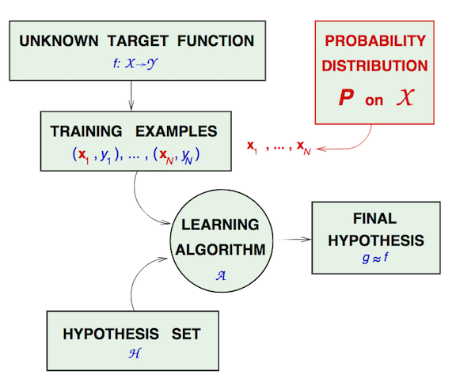
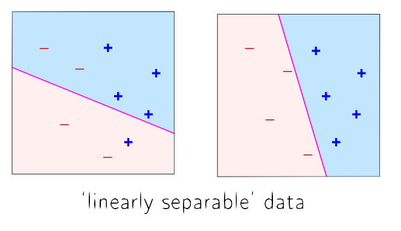

<!-- page_number: true -->
# Aprendizaje automático

---
# Ejemplos de aprendizaje automático
* Puntuación crediticia
* Recomendación de peliculas
* ¿Cuales otros?

---
# Requerimientos
* Existe un patron
* No podemos modelarlo matemáticamente
* Tenemos datos sobre este problema

---
# Describir las solicitudes como un vector de valores. 
* Puntuación crediticia, informacion de la solicitud:
  |Caracteristica|Atributo|
  |--|--|
  |edad|23 años|
  |genero|masculino|
  |salario|$30,000|
  |tiempo en su residencia|1 año|
  |tiempo en su empleo|1 año|
  |deuda actual|$15,000|
  |...|...|

---
# Formalización

* Entrada: $\mathbf{x}$ (solicitud de crédito)
* Salida: $y$  (bueno/malo)
* Función objetivo: $f:\mathcal{X} \rightarrow \mathcal{Y}$ (formula ideal de aprobación)
* Datos: $(\mathbf{x}_1, y_1), (\mathbf{x}_2, y_2), ... , (\mathbf{x}_N, y_N)$ (Registos historicos)

* Hipotesis: $g: \mathcal{X} \rightarrow \mathcal{Y}$ (fórmula que usaremos)

---
# Diagrama de aprendizaje automático

---
# Componentes de la solución
* El __Conjunto de hipotesis__
$$ \mathcal{H} = \{h\}$$ 
$$g\in\mathcal{H}$$
* El __Algoritmo de aprendizaje__.

Juntos forman __el modelo__ de aprendizáje.

---
# El perceptrón
* Para los datos de entrada $\mathbf{x} = (x_1, ..., x_N)$ atributos de un cliente
	* La solicitud es _buena_ si  $\sum_{i=1}^d w_ix_i > \mathrm{umbral}$
	* La solicitud es _mala_ si $\sum_{i=1}^d w_ix_i < \mathrm{umbral}$
* Esta fórmula lineal $h\in\mathcal{H}$ puede escribirse como:
$$ h(\vec x) = \mathrm{sign}\left(\left(\sum_{i=1}^d w_ix_i\right) - \mathrm{umbral}\right)$$

---
# El perceptrón
* Definimos $w_0 = \mathrm{umbral}$, $x_0 = 1$
$$ h(\mathbf{x}) = \mathrm{sign}\left(\sum_{i=0}^d w_i x_i\right) = \mathrm{sign}(\mathbf{w}^\intercal\mathbf{x})$$

---
# El algoritmo de aprendizaje del perceptrón
1. Escoger un punto __mal clasificado__:
$$ \mathrm{sign}(\mathbf{w}^\intercal\mathbf{x}_n) \neq y_n$$
2. Actualizar el vector de pesos:
$$\mathbf{w} = \mathbf{w} + y_n\mathbf{x}_n $$

Si los datos son linealmente separables, esta garantizado que converge.

---
# Tipos de aprendizaje automático
 Usando un conjunto de observaciones descubrir un proceso escondido
 * Aprendizaje supervisado (entrada, salida correcta)
 * Aprendizaje no supervisado (entrada, ?)
 * Aprendizaje por reforzamiento (entrada, salida, que tan correcta?)

---
# ¿Es posible aprender?
* Queremos aproximarnos a la funcion $f$, sin embargo, solo conocemos como se comporta $f$ en $\mathbf{x}_1 ... \mathbf{x}_N$.
* ¿Cómo podemos conocer el comportamiento de $f$ para nuevos datos de entrada $\mathbf{x}'_1...\mathbf{x}'_M$?

---
# Errores
* Error en la muestra $E_\mathrm{in}$: Medida de la desigualdad entre $f$ y $g$ en los datos con los que se entreno $g$.
* Error fuera de la muestra $E_\mathrm{out}$: Medida de la desigualdad entre $f$ y  $g$ en datos nuevos.
* __Vamos a garantizar que $E_\mathrm{in} \approx E_\mathrm{out}$__
* ¿Cómo podemos conocer o aproximarnos a $E_\mathrm{out}$?