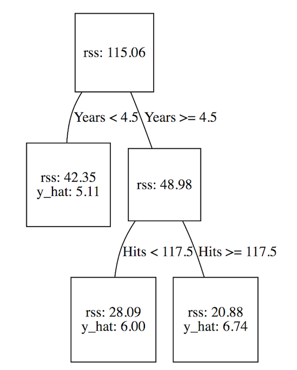

# Tree-Based Methods

- Involve stratifing or segmenting the predictor space into a number of simple regions.

---
# Regression Trees

* Two Steps:
    1.- Divide the predictor space $X$ into $J$ distinct and non-overlapping regions $R_1, R_2, ..., R_J$
    2.- For every observation that falls into the region $R_j$, we make the same prediction, which is simple the mean of the response values for the tranin observation in $R_j$

---
# Regression Trees
* The goal is to find boxes $R_1, ..., R_J$ that minimize the __residual squared sum__, given by:

$$\mathrm{RSS} = \sum_{j=1}^J \sum_{i \in R_j}(y_i - \hat y_{R_j})^2$$

where $\hat y_{R_j}$ is the mean response for the training observations within the $j$th box.

* Infeasible to consider every possible partition.

---
# Top-down, greedy, recursive binary splitting.
* __top-down__: It begins at the top of the tree, at which point all observations belong to a single region.
* __greedy__: At each step of the tree-building process, the _best_ split is made at that particular step.

---
# Recursive Binary Splitting
1. Select the predictor $X_j$ and the cut point $s$ such that splitting the predictor space into regions $R_1(j,s) = \{X|X_j < s\}$ and $R_2(j,s) = \{X|X_j \geqslant s\}$ that leads to the greatest posible reduction in RSS.

$$\sum_{i: x_i\in R_1(j,s)} (y_i - \hat y_{R_1})^2 + \sum_{i: x_i\in R_2(j,s)} (y_i - \hat y_{R_2})^2 $$

---
# Recursive Binary Splitting
2. We repeat the process, looking for the best predictor and best cutpoint in order to split the data further so as to minimize the RSS within each of the resulting regions. However, this time, instead of splitting the entire predictor space, we split one of the two previously identified regions. We now have three regions. Again, we look to split one of these three regions further, so as to minimize the RSS. The process continues until a stopping criterion is reached; for instance, we may continue until no region contains more than five observations.

---
# Recursive Binary Splitting
3. Once the regions $R_1,...,R_J$ have been created,we predict the response for a given test observation using the mean of the training observations in the region to which that test observation belongs.

---
# Recursive Binary Splitting
