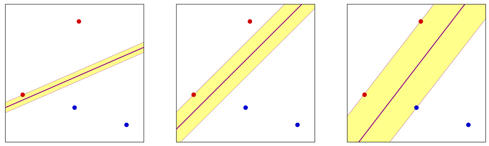
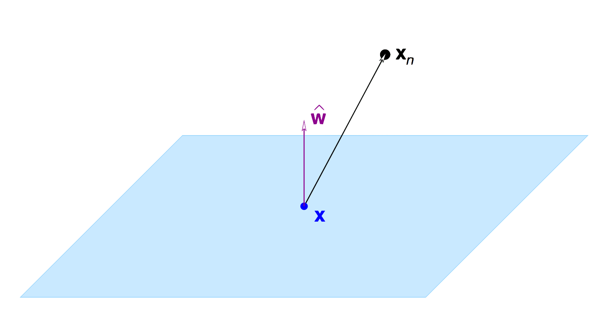
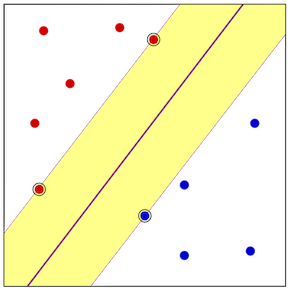
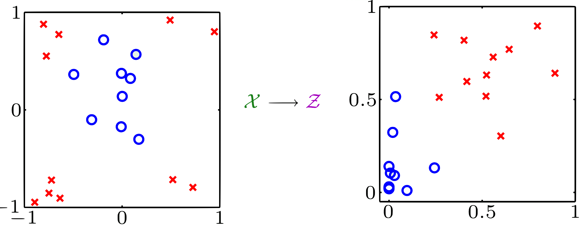
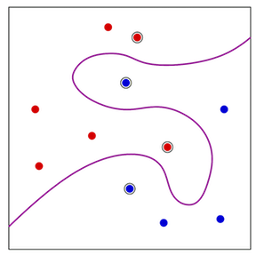
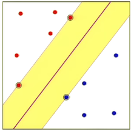
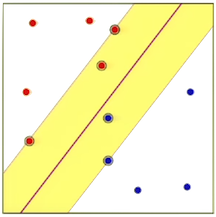
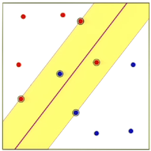

# Support Vector Machines

* Maximizing the margin
* The Solution
* Nonlinear transforms

---
# Better linear separation
* __Linearly separable data.__
* Different separating lines.
* Which is the best separating line?
    - Intuitive choose the biggest margin.
    - Why is bigger margin better?
    - Which $\mathrm{w}$ maximizes the margin?

---
# Find $\mathrm{w}$ with large margin
* Let $\mathrm{x}_n$ be the nearest point to the plane $\mathrm{w}^\intercal\mathrm{x} = 0$
    * How far is it?
* Preliminary technicalities
    * Normalize $\mathrm{w}$: $|\mathrm{w}^\intercal\mathrm{x}_n|  = 1$
    * Pull out $w_0$: $\mathrm{w} = (w_1, ..., w_d)$ apart from $b$ The plane is now $\mathrm{w}^\intercal\mathrm{x} + b$ (no $x_0$)

---
# Computing the distance
* The distance between $\mathrm{x}_n$ and the plane $\mathrm{w}^\intercal\mathrm{x} +b = 0$ where $|\mathrm{w}^\intercal\mathrm{x}_n + b| = 1$
* The vector $\mathrm{w}$ is $\perp$ to the plane in the $\mathcal{X}$ space:
    - Take $\mathrm{x}'$ and $\mathrm{x}''$ on the plane
    - $\mathrm{w}^\intercal\mathrm{x}' + b = 0$ and $\mathrm{w}^\intercal\mathrm{x}'' + b = 0$
    - $\mathrm{w}^\intercal(\mathrm{x}' - \mathrm{x}'') = 0$

---
# the distance is ...
* The distance between $\mathrm{x}_n$ and the plane:
    * Take any point $\mathrm{x}$ on the plane
    * Projection of $\mathrm{x}_n - \mathrm{x}$ on $\mathrm{w}$
    * $\hat{\mathrm{w}} = \frac{\mathrm{w}}{|\mathrm{w}|}$ =>
    * distance = $|\hat{\mathrm{w}}^\intercal(\mathrm{x}_n - \mathrm{x})|$
    * distance = $\frac{1}{|\mathrm{w}|}|\mathrm{w}^\intercal\mathrm{x}_n - \mathrm{w}^\intercal\mathrm{x}|$ = $\frac{1}{|\mathrm{w}|}|\mathrm{w}^\intercal\mathrm{x}_n + b - \mathrm{w}^\intercal\mathrm{x} - b|$ = $\frac{1}{|\mathrm{w}|}$

---
# The optimization problem
* Maximize $\frac{1}{|\mathrm{w}|}$
    * Subject to $\mathrm{min}_{1,2,...,N}|\mathrm{w}^\intercal\mathrm{x}_n + b| = 1$
    * Notice $|\mathrm{w}^\intercal\mathrm{x}_n + b| = y_n(\mathrm{w}^\intercal\mathrm{x}_n + b)$

* Minimize $\frac{1}{2}\mathrm{w}^\intercal\mathrm{w}$
    * Subject to $y_n(\mathrm{w}^\intercal\mathrm{x}_n +b) \geq 1$ for $n = 1, 2, ..., N$

---
# The solution
* Lagrange. inequality constraints: KKT
<!-- * Remember regularization? -->

---
# Lagrange formulation
* Minimize $\mathcal{L}(\mathrm{w}, b, \alpha) =  \frac{1}{2}\mathrm{w}^\intercal\mathrm{w} - \sum_{n=1}^N \alpha_n\left(y_n(\mathrm{w}^\intercal\mathrm{x}_n +b) - 1 \right)$
    * w.r.t $\mathrm{w}$ and $b$ and maximize w.r.t each $\alpha_n \geq 0$
    * $\nabla_\mathrm{w}\mathcal{L} = \mathrm{w} - \sum_{n=1}^N\alpha_n y_n\mathrm{x}_n = 0$
    * $\frac{\partial\mathcal{L}}{\partial b} = - \sum_{n=1}^N\alpha_n y_n = 0$

---
# Substituting ...
$\mathrm{w} = \sum_{n=1}^N\alpha_n y_n \mathrm{x}_n$ and $\sum_{n=1}^N\alpha_n y_n = 0$
in the Lagrangian
$$ \mathcal{L}(\mathrm{w}, b, \alpha) = \frac{1}{2}\mathrm{w}^\intercal\mathrm{w}  - \sum_{n=1}^N\alpha_n(y_n(\mathrm{w}^\intercal\mathrm{x}_n) - 1 )$$
we get
$$ \mathcal{L}(\alpha) = \sum_{n=1}^N\alpha_n - \frac{1}{2}\sum_{n=1}^N\sum_{m=1}^N y_n y_m\alpha_n\alpha_m\mathrm{x}_n^\intercal\mathrm{x}_m $$
Maximize w.r.t to $\alpha$ subject to $\alpha_n \geq 0$ for $n = 1, ..., N$

---
# The solution - quadratic programming
$$ \min_\alpha\frac{1}{2}\mathrm{\alpha}^\intercal \mathrm{Q}\mathrm{\alpha} - 1^\intercal\mathrm{\alpha}$$
subject to
$$ \mathrm{y}^\intercal\mathrm{\alpha = 0}; \mathrm{\alpha} \geq 0 $$
Quadratic Programming hand us $\mathrm{\alpha}$

---
# Support vectors
* Remember the condition:
	* $\alpha_n(y_n(\mathrm{w}^\intercal\mathrm{x} + b) - 1) = 0$ => $\alpha = 0$ or `slack` = 0
* Closest $\mathrm{x}_n$'s to the plane achieve the margin.
    * => $y_n(\mathrm{w}^\intercal\mathrm{x}_n + b) = 1$
    * $\mathrm{w} = \sum_{\mathrm{x}_n \in \mathrm{SV}} \alpha_n y_n \mathrm{x}_n$
* Solve $b$ using any SV:
    * $y_n(\mathrm{w}^\intercal\mathrm{x}_n + b) = 1$ 

---
# Non linear transform (z instead of x)
$$ \mathcal{L}(\alpha) = \sum_{n=1}^N\alpha_n - \frac{1}{2}\sum_{n=1}^N\sum_{m=1}^N y_ny_m\alpha_n\alpha_m\mathrm{z}_n^\intercal\mathrm{z}_m$$

---
# "Support vectors" in $\mathcal{X}$ space
* Support vectors live in $\mathcal{Z}$ space
* In $\mathcal{X}$ space, "pre-images" of support vectors$
* Generalization result:
$$ \mathbb{E}\left[E_{\mathrm{out}}\right] \leq \frac{\mathbb{E}[\#\mathrm{SV}]}{N-1} $$

---
# Soft Margin
Minimize
$$\frac{1}{2}\mathrm{w}^\intercal\mathrm{w}
+ C\sum_{n=1}^N\xi_n$$
subject to $y_n(\mathrm{w}^\intercal\mathrm{x}_n + b) \geq 1 - \xi_n$ for $n=1,...,N$
and $\xi_n \geq 0$ for  $n=1,...,N$

---
# Lagrange formulation
$$\mathcal{L}(\mathrm{w}, b, \xi, \mathrm{\alpha}, \mathrm{\beta}) = $$
$$\frac{1}{2}\mathrm{w}^\intercal\mathrm{w} 
+ C\sum_{n=1}^N\xi_n
-\sum_{n=1}^N\alpha_n(y_n(\mathrm{w}^\intercal\mathrm{x}_n+b) -1 + \xi_n)
-\sum_{n=1}^N\beta_n\xi_n$$
Minimize w.r.t. $\mathrm{w}, b$ and $\xi$,
and maximize w.r.t each $\alpha_n\geq0$ and $\beta_n \geq 0$
* $\nabla_\mathrm{w}\mathcal{L} = \mathrm{w} - \sum_{n=1}^N\alpha_n y_n x_n = 0$
* $\frac{\partial\mathcal{L}}{\partial b} = -\sum_{n=1}^N\alpha_n y_n = 0$
* $\frac{\partial\mathcal{L}}{\partial\xi_n} = C - \alpha_n -\beta_n = 0$

---
# and the solution is ...
Maximize
$$\mathcal{L}(\mathrm\alpha) = \sum_{n=1}^N\alpha_n - \frac{1}{2}\sum_{n=1}^N\sum_{m=1}^N y_n y_m \alpha_n \alpha_m \mathrm{x}_n^\intercal\mathrm{x}_m$$
w.r.t to $\mathrm{\alpha}$ subject  to $0 \leq \alpha_n \leq C$ for $n=1,...,N$ and
$$\sum_{n=1}^N\alpha_n y_n = 0$$
$$ $$

---
# Types of support vectors
* __margin__ support vectors $(0 < \alpha_n < C)$
$$y_n(\mathrm{w}^\intercal\mathrm{x}_n + b ) = 1 \,\,\,\,\,(\xi_n = 0)$$
* __non-margin__ support vec tors $(\alpha_n = C)$
$$y_n(\mathrm{w}^\intercal\mathrm{x}_n + b ) < 1 \,\,\,\,\,(\xi_n > 0)$$

